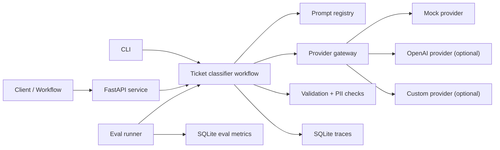

Blacklight Studio is a compact internal AI workflow studio that shows how teams can route model calls through shared provider, prompt, eval, guardrail, and observability layers instead of scattering one-off prompts across applications.

The default path is fully local and deterministic: it uses a mock provider, synthetic support-ticket data, SQLite traces, and pytest coverage. Optional provider adapters can be added without making live API keys required for development or CI.

## Why This Exists

AI applications tend to need the same platform primitives once they move past experiments:

- provider routing with consistent request and response objects
- versioned prompts with inspectable metadata
- guardrails that turn model output into routing decisions
- evals that catch prompt/model regressions
- traces that connect latency, token use, cost, failures, and validation outcomes
- CLI/API surfaces that are easy to smoke test locally

Blacklight Studio keeps those ideas small enough to read quickly while still runnable end to end.

## What To Review First

- [src/llm_platform_starter/examples/ticket_classifier.py](src/llm_platform_starter/examples/ticket_classifier.py): example workflow using prompts, providers, guardrails, retries, idempotency, and traces
- [src/llm_platform_starter/providers/factory.py](src/llm_platform_starter/providers/factory.py): mock/OpenAI/custom provider selection
- [docs/provider-configuration.md](docs/provider-configuration.md): OpenAI, custom provider, and Ollama local-runtime configuration
- [src/llm_platform_starter/evals/runner.py](src/llm_platform_starter/evals/runner.py): deterministic regression evals
- [src/llm_platform_starter/observability/storage.py](src/llm_platform_starter/observability/storage.py): SQLite trace store and metrics
- [docs/architecture.md](docs/architecture.md): component boundaries and request flow
- [docs/create-your-own-workflow.md](docs/create-your-own-workflow.md): guide for adapting the starter to a new task
- [docs/tradeoffs.md](docs/tradeoffs.md): what is intentionally simplified
- [docs/operational-cost-and-ownership.md](docs/operational-cost-and-ownership.md): cost and ownership model for regular live runs
- [docs/release-notes.md](docs/release-notes.md): v0.1.0 CLI-ready release notes

## Features

- Deterministic mock provider for local development and CI
- Optional OpenAI provider, custom provider import path, and Ollama local-runtime configuration
- Versioned prompt registry backed by JSON templates
- Pydantic output validation and simple PII detection
- Guardrail outcomes: `accepted`, `needs_review`, and `rejected`
- Retry, timeout, per-session rate limiting, and idempotency support
- SQLite traces for latency, tokens, estimated cost, validation, guardrail outcome, and provider failure categories
- Persisted eval run/case metrics linked back to trace records
- CLI commands for guided demos, classification, evals, metrics, health, prompts, and traces
- FastAPI surface for the ticket-classification workflow

## Quick Start

```bash
python -m venv .venv
.venv\Scripts\activate
pip install -e ".[dev,api]"
pytest
```

Check the default runtime:

```bash
llm-platform health
```

Expected default signal:

```json
{
  "provider": "mock",
  "model": "mock-ticket-classifier",
  "openai_configured": false,
  "custom_provider_configured": false
}
```

The mock provider is the intended fresh-clone path. No API key is required.

Run the guided first demo:

```bash
llm-platform demo --verbose
```

The demo uses the mock provider, runs the `ticket_classifier` workflow with synthetic sample input, writes a trace, and prints the exact follow-up commands for trace inspection, evals, and the equivalent lower-level workflow call.

Seed demo state for console/API surfaces:

```bash
llm-platform seed demo-data --trace-db-path traces.sqlite3
```

The seed command loads synthetic mock-mode sample inputs, successful and needs-review trace records, a persisted eval run with linked eval cases, and prompt-version metadata. It is safe to rerun: stable request IDs and eval run IDs update existing demo records instead of duplicating them.

## CLI Example

```bash
llm-platform classify ^
  --subject "Refund request" ^
  --body "Customer asks for a refund after duplicate billing." ^
  --trace-db-path traces.sqlite3 ^
  --session-id demo
```

Example output:

```json
{
  "category": "billing",
  "severity": "medium",
  "confidence": 0.92,
  "rationale": "Matched synthetic billing support-ticket signals.",
  "needs_review": false
}
```

## API Example

Run the API:

```bash
uvicorn llm_platform_starter.api:app --reload
```

Request:

```bash
curl -X POST http://127.0.0.1:8000/classify-ticket ^
  -H "Content-Type: application/json" ^
  -d "{\"subject\":\"Refund request\",\"body\":\"Customer asks for a refund after duplicate billing.\"}"
```

Response:

```json
{
  "category": "billing",
  "severity": "medium",
  "confidence": 0.92,
  "rationale": "Matched synthetic billing support-ticket signals.",
  "needs_review": false
}
```

Structured API errors include `category`, `message`, `likely_cause`, and `next_step` for provider, configuration, validation, and idempotency failures.

After requests have written traces, inspect session history in the app:

```text
http://127.0.0.1:8000/sessions/demo
```

The session page shows a timeline of workflow runs with provider, model, status, estimated cost, review outcome, and failure reason. Use the `accepted`, `needs_review`, `rejected`, and `failed` filters to review the same trace/session model exposed by `llm-platform session show`.

Review outputs routed to human review:

```text
http://127.0.0.1:8000/reviews
```

The review queue lists `needs_review` and `rejected` outputs, explains why each item was routed there, and lets a reviewer record `approved`, `rejected`, or `needs_more_info` decisions. Approved items are marked as allowed for downstream work; pending, rejected, and needs-more-info items stay blocked and auditable.

## Docker Example

Build the API image:

```bash
docker build -t llm-platform-starter .
```

Run the container in default mock mode:

```bash
docker run --rm -p 8000:8000 llm-platform-starter
```

Check the API health endpoint:

```bash
curl http://127.0.0.1:8000/health
```

Expected response:

```json
{
  "status": "ok"
}
```

The image defaults to `LLM_PROVIDER=mock`, `LLM_MODEL=mock-ticket-classifier`, and `TRACE_DB_PATH=/app/data/traces.sqlite3`, so no API key or live provider is required. Override those environment variables with `docker run -e ...` when testing a real provider configuration.

## Eval Example

Run deterministic evals:

```bash
llm-platform eval run --trace-db-path traces.sqlite3 --session-id eval-demo
```

The eval report includes a summary and per-case diagnostics:

```json
{
  "fixture_name": "ticket_classification.jsonl",
  "provider": "mock",
  "model": "mock-ticket-classifier",
  "summary": {
    "case_count": 3,
    "accuracy": 1.0,
    "schema_validity_rate": 1.0,
    "needs_review_rate": 0.3333,
    "total_tokens": 122,
    "total_estimated_cost_usd": 0.0,
    "error_rate": 0.0
  }
}
```

Inspect persisted eval history:

```bash
llm-platform eval list --trace-db-path traces.sqlite3
llm-platform eval show <eval_run_id> --trace-db-path traces.sqlite3
```

Each eval case includes a `trace_request_id` so a case can be followed into the trace store.

Compare prompt versions:

```bash
llm-platform eval compare --baseline-version 1 --candidate-version 2
```

Prompt comparison is metadata-gated: versions must share the same comparison group, output schema, and eval fixture before the report will treat them as comparable.

## Trace And Metrics Example

List recent traces:

```bash
llm-platform trace list --trace-db-path traces.sqlite3 --limit 1
```

Example trace:

```json
{
  "request_id": "810f8946-5bd8-4a85-9463-438dfbeac487",
  "session_id": "demo",
  "prompt_id": "ticket_classifier",
  "prompt_version": 1,
  "provider": "mock",
  "model": "mock-ticket-classifier",
  "latency_ms": 11.76,
  "input_tokens": 27,
  "output_tokens": 14,
  "estimated_cost_usd": 0.0,
  "validation_passed": true,
  "guardrail_outcome": "accepted",
  "error_category": null
}
```

Show one trace:

```bash
llm-platform trace show <trace_id> --trace-db-path traces.sqlite3
```

Inspect all traces for one session in chronological order:

```bash
llm-platform session show demo --trace-db-path traces.sqlite3
```

Session history is for operational review: it shows what happened during a user, workflow, or CI session, including per-request traces and aggregate totals for tokens, estimated cost, failures, review routing, and provider/model usage. Prompt comparison is for eval regression: it compares two compatible prompt versions against the same fixture and schema.

Print aggregate metrics:

```bash
llm-platform metrics --trace-db-path traces.sqlite3
```

Example metrics:

```json
{
  "request_count": 1,
  "avg_latency_ms": 11.76,
  "total_estimated_cost_usd": 0.0,
  "failure_rate": 0.0,
  "validation_failure_rate": 0.0,
  "by_provider": [
    {
      "provider": "mock",
      "request_count": 1,
      "failure_rate": 0.0
    }
  ],
  "by_guardrail_outcome": [
    {
      "guardrail_outcome": "accepted",
      "request_count": 1
    }
  ]
}
```

The full metrics payload also includes breakdowns by model and provider/model pair.

## Architecture



The API and CLI use the same workflow path. Evals also run through the same provider, prompt, guardrail, and trace layers so regression reports exercise platform behavior rather than a separate script-only path.

## Provider Configuration

For local console use, copy `user.env.example` to `user.env` and put app-editable settings there. The console settings API is allowed to read and update `user.env`.

Keep `.env` for private operator-owned values that the app should not edit. Runtime process environment variables still take precedence over `user.env`, so deployment systems, shell exports, and CI secrets can override local user settings without rewriting files.

The default provider is the deterministic local mock:

```bash
set LLM_PROVIDER=mock
```

To use OpenAI:

```bash
pip install -e ".[openai]"
set LLM_PROVIDER=openai
set OPENAI_API_KEY=...
set LLM_MODEL=gpt-4o-mini
```

To use your own provider:

```bash
set LLM_PROVIDER=custom
set LLM_CUSTOM_PROVIDER=my_package.providers:MyProvider
set LLM_MODEL=my-model
```

`LLM_CUSTOM_PROVIDER` can point to an `LLMProvider` subclass, an `LLMProvider` instance, or a zero-argument factory returning one.

The project is also configured for local model experiments with Ollama. Use the included `docker-compose.ollama.yml` to start Ollama, pull a model such as `llama3.1`, and point `LLM_CUSTOM_PROVIDER` at the bundled `llm_platform_starter.providers.ollama_provider:OllamaProvider` adapter. Users who already have their own provider, local endpoint, or model runtime can keep using the same custom-provider contract instead.

Local model servers such as Ollama, LM Studio, llama.cpp, vLLM, or a private localhost endpoint can use the same custom provider path. See [docs/provider-configuration.md](docs/provider-configuration.md).

## Guardrails And Review Routing

Guardrails treat validation as a routing decision:

- `accepted`: JSON parsed, schema validation passed, and no review signal was found
- `needs_review`: schema validation passed, but PII detection or the model's `needs_review` flag requires human review
- `rejected`: JSON parsing or schema validation failed

The document-extraction example shows a synthetic Pangea government RFP/work order for dignified senior housing. It converts the work order into an invoice-style materials list and routes accepted, needs-review, and rejected outputs through a lightweight local human-review queue:

```bash
python -m llm_platform_starter.examples.document_extraction
```

## Production Extensions

Blacklight Studio intentionally uses local, inspectable defaults. A production version would likely add:

- managed trace storage or OpenTelemetry export
- stronger PII/secrets detection and policy-specific guardrails
- reviewer queue integration for `needs_review` outcomes
- provider-specific auth, quotas, and circuit breakers
- model/prompt comparison reports
- deployment packaging and environment-specific configuration
- live provider smoke tests gated behind secrets and explicit flags

See [docs/tradeoffs.md](docs/tradeoffs.md), [docs/failure-modes.md](docs/failure-modes.md), [docs/operational-cost-and-ownership.md](docs/operational-cost-and-ownership.md), and [docs/roadmap.md](docs/roadmap.md) for more detail.

See [docs/release-notes.md](docs/release-notes.md) for the v0.1.0 CLI-ready release summary.

## Public-Safe Data

All examples, prompts, and eval fixtures are synthetic and public-safe. They avoid real customers, companies, private identifiers, and proprietary workflows.

## Project Status

MVP scaffold complete:

- runnable mock-provider path
- CLI and FastAPI workflow surfaces
- provider gateway and prompt registry
- guardrail validation and review routing
- trace and eval persistence
- deterministic tests and CI-ready defaults
