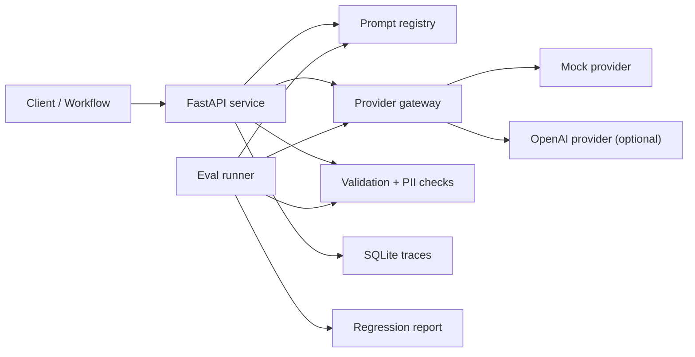

# llm-platform-starter

A minimal shared AI platform for routing model calls, tracking prompts, evaluating outputs, enforcing guardrails, and logging cost and latency.

This project demonstrates the internal platform layer teams need once LLM usage moves beyond one-off prompts. It is intentionally small, public-safe, and built around synthetic support-ticket classification examples.

## What It Shows

- Provider gateway with a deterministic mock provider and optional OpenAI provider
- Prompt registry with versioned templates stored as JSON
- Evaluation harness for regression checks across prompt and model versions
- Guardrails using Pydantic schema validation and simple PII detection
- SQLite trace logging for request, latency, token, cost, validation, and error metadata
- FastAPI service surface for an example ticket-classification workflow
- Documentation for architecture, tradeoffs, eval methodology, failure modes, and roadmap

## Quick Start

```bash
python -m venv .venv
.venv\Scripts\activate
pip install -e ".[dev,api]"
pytest
```

Check the local runtime:

```bash
llm-platform health
```

Run the API:

```bash
uvicorn llm_platform_starter.api:app --reload
```

Try a classification request:

```bash
curl -X POST http://127.0.0.1:8000/classify-ticket ^
  -H "Content-Type: application/json" ^
  -d "{\"subject\":\"Refund request\",\"body\":\"Customer asks for a refund after duplicate billing.\"}"
```

Run evals:

```bash
llm-platform eval
```

Inspect persisted eval history:

```bash
llm-platform eval list
llm-platform eval show <eval_run_id>
```

## Provider Configuration

The default provider is the deterministic local mock:

```bash
set LLM_PROVIDER=mock
```

To use OpenAI, install the optional dependency and configure an API key:

```bash
pip install -e ".[openai]"
set LLM_PROVIDER=openai
set OPENAI_API_KEY=...
```

To use your own provider, implement `LLMProvider` and point `LLM_CUSTOM_PROVIDER` at an import path:

```bash
set LLM_PROVIDER=custom
set LLM_CUSTOM_PROVIDER=my_package.providers:MyProvider
```

The import path can resolve to an `LLMProvider` subclass, an instance, or a zero-argument factory that returns one.

For local model servers such as Ollama, LM Studio, llama.cpp, or a private localhost endpoint, use the same custom provider path. See [docs/provider-configuration.md](docs/provider-configuration.md) for a local HTTP adapter example and later smoke-test guidance.

## Provider Reliability

Provider calls use a small retry and timeout wrapper so the demo surfaces basic production behavior without becoming a full orchestration framework.

Defaults:

```bash
set LLM_PROVIDER_TIMEOUT_SECONDS=30
set LLM_PROVIDER_MAX_RETRIES=2
set LLM_PROVIDER_RATE_LIMIT_REQUESTS=3
set LLM_PROVIDER_RATE_LIMIT_WINDOW_SECONDS=10
```

Rate limiting is applied per `session_id` so one busy workflow does not throttle every user. API callers can pass `session_id` in the JSON body or `X-Session-Id` as a header. CLI callers can pass `--session-id`.

Retries reuse a stable `idempotency_key` in provider request metadata so providers can avoid duplicated side effects or repeated output across attempts. Successful ticket classifications are also cached in SQLite by idempotency key, so repeated calls across processes or restarts can return the completed result without calling the provider again. The built-in OpenAI adapter forwards this as an `Idempotency-Key` header. Custom providers should honor `request.metadata["idempotency_key"]` when their backend supports idempotency.

Provider failures are categorized in trace metadata as `provider_error`, `provider_timeout`, or `provider_empty_response` when a trace store is configured. Null, empty, or whitespace-only provider outputs are retried before schema validation runs.

## Architecture



See [docs/architecture.md](docs/architecture.md) for the system design and [docs/tradeoffs.md](docs/tradeoffs.md) for what is intentionally deferred.

## Example Task

The included example classifies synthetic support tickets into:

- `billing`
- `technical`
- `account`
- `general`

The output schema also captures severity, confidence, and whether a human review is needed.

## Public-Safe Data

All examples, prompts, and eval fixtures are synthetic and public-safe. They avoid real customers, companies, private identifiers, and proprietary workflows.

## Project Status

MVP scaffold complete:

- deterministic provider path for local tests
- versioned prompt loading
- ticket-classification workflow
- guardrail validation
- trace persistence
- eval runner
- test suite
- CI workflow

Planned next steps are tracked in [docs/roadmap.md](docs/roadmap.md).
