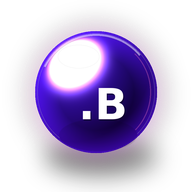

# Sidebar Variations

GitHub Wiki uses `_Sidebar.md` as the active sidebar. Pick one variation below, then copy that file to `_Sidebar.md` in the wiki folder.

## Command Deck

The current default. Uses a small glowing orb and compact command-menu labels so it fits the GitHub Wiki right rail without feeling like another banner.

[View source](_Sidebar.command-deck)

  

## Console

Uses the terminal-flavored badge and grouped operator-style navigation.

[View source](_Sidebar.console)

  

## Map

Uses numbered sections for a clear end-user reading path.

[View source](_Sidebar.map)

  

## Minimal

The quietest option: small brand strip, compact link groups, and fewer visual markers.

[View source](_Sidebar.minimal)

  

