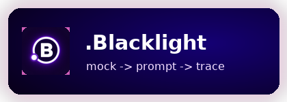

  

**Start**

[Home](Home)  
[Quick Start](Home#quick-start)  
[Release Notes](release-notes)

**Build**

[Architecture](architecture)  
[Provider Configuration](provider-configuration)  
[Create Your Own Workflow](create-your-own-workflow)

**Operate**

[Eval Methodology](eval-methodology)  
[Failure Modes](failure-modes)  
[Operational Cost](operational-cost-and-ownership)

**Reference**

[Tradeoffs](tradeoffs)  
[Desktop Packaging](desktop-packaging)  
[Roadmap](roadmap)

